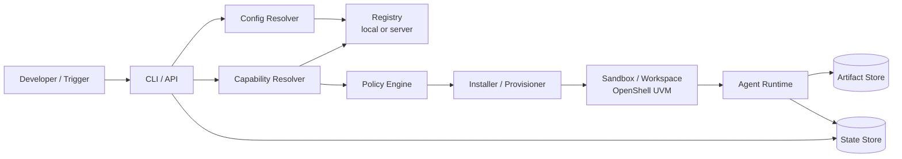

# Actors and Interactions

This page names the moving parts in Oktopus so registry, configuration, sandbox, runtime, and control-plane responsibilities do not blur together.

## Actors

### Human and external actors

| Actor | Role |
|---|---|
| **Developer / operator** | Runs CLI/API actions, creates coding sessions, attaches to sandboxes, inspects events and artifacts. |
| **Admin / platform owner** | Approves capabilities, policies, profiles, registry sources, and install presets. |
| **External trigger** | CI, ticket, chat, alert, schedule, or API event that creates a run. |

### Control-plane actors

| Actor | Role |
|---|---|
| **CLI / API / Portal** | User-facing entrypoints. Local mode reads files; server mode calls Oktopus APIs. |
| **Config resolver** | Resolves profile, registry source, database URL, runs dir, server URL, and auth. |
| **Registry** | Stores capability manifests: workflows, runtimes, tools, verifiers, profiles, adapters, skillpacks, policies. Can be local files or server-backed. |
| **Resolver** | Turns references like `workflow:hello-local`, `runtime:pi`, or `verifier:artifact-exists` into concrete, approved manifests. |
| **Installer / provisioner** | Materializes registry resources into an environment using an install profile. |
| **Session manager** | Creates coding sessions, records timeline events, tracks share state, and links sessions to user-bound sandbox instances. |
| **Policy engine** | Answers whether a subject/job/tool/resource/action is allowed. |
| **Store** | Durable relational state boundary. SQLite local now; Postgres later. |
| **Artifact store** | Stores session output bytes. Filesystem local now; object storage later. |
| **Memory service** | Runtime-agnostic scoped memory and retrieval. Agents consume/propose memory; Oktopus owns it. |

### Execution actors

| Actor | Role |
|---|---|
| **OpenShell provider** | Oktopus wrapper around OpenShell sandbox create/connect/exec/log operations. |
| **Workspace definition** | Immutable org/platform-scoped template for source, environment, and global resource references. |
| **Sandbox instance** | User-bound private runtime created from workspace + profile + session context. May contain user identity and secrets. |
| **OpenShell supervisor** | Sandbox-local process that launches and restricts the agent, applies policy, routes egress, and relays logs/connect traffic. |
| **Agent runtime** | The actual agent process inside the sandbox. For MVP it is just another managed process with prepared filesystem context. |
| **Tools / MCP servers** | Future callable capabilities made available to agents by policy. MCP is not the primary workspace manager. |

## Configuration artifacts

Registry items describe **what exists**. Profiles describe **how to materialize it**. Workspaces are immutable shared definitions; sandboxes are private running instances.

| Artifact | Lives in | Purpose |
|---|---|---|
| `workflow` | registry | Deferred DAG/process definition. Not part of first coding-session MVP. |
| `runtime` | registry | Executable runtime type: shell, Pi, OpenShell, etc. |
| `adapter` | registry/code | Bridge metadata for external systems. |
| `tool` | registry | Callable capability, permissions, input/output contract. |
| `verifier` | registry | Evidence gate. |
| `skillpack` | registry | Source of importable skills/personas/workflows/references. |
| `environment` | registry | Sandbox/workspace class: local process, container, OpenShell UVM, gVisor, microVM. |
| `profile` | registry/config | Install preset that maps logical paths/resources to concrete sandbox paths. |
| `policy` | registry/config/server | Permissions, approvals, scopes, network/secrets/tool rules. |
| `memory` | store | Scoped facts, decisions, summaries, procedures, preferences. Not owned by any agent runtime. |
| `resource` | inside capability/profile | Input file/directory/settings to install into a sandbox. |
| `artifact` | artifact store | Output produced by a session or agent process. |

Use **resource** for things placed into a runner before execution. Use **artifact** for things produced by execution.

## Registry to sandbox flow



## OpenShell/UVM materialization model

For a Mac local runner using `nvidia/openshell`, treat the UVM as an environment with a real filesystem. Oktopus should not let every capability hard-code guest paths. Instead:

```text
capability resource target → install profile namespace → concrete guest path
```

Example capability resource:

```yaml
resources:
  - name: pi-settings
    type: file
    source: files/pi/settings.json
    target: config:pi/settings.json
  - name: project-skills
    type: directory
    source: skills/
    target: skills:project/
```

Example OpenShell profile:

```yaml
kind: profile
name: openshell-mac-local
runtime: runtime:openshell
paths:
  workspace: /workspace
  config: /home/agent/.config/oktopus
  skills: /home/agent/.local/share/oktopus/skills
  tools: /home/agent/.local/share/oktopus/tools
  cache: /home/agent/.cache/oktopus
  stage: /oktopus/stage
```

Resolved inside the UVM:

```text
config:pi/settings.json  → /home/agent/.config/oktopus/pi/settings.json
skills:project/          → /home/agent/.local/share/oktopus/skills/project/
workspace:               → /workspace
stage:                   → /oktopus/stage
```

## MVP execution sequence

```text
1. CLI/API resolves profile and local config.
2. Immutable workspace definition is selected or created from a local path/source ref.
3. User-bound sandbox instance is created or selected for that workspace/profile/session.
4. Coding session is created in the store and may be shared by policy.
5. Oktopus materializes the workspace for sandbox startup.
6. OpenShell provider creates or selects a private sandbox instance.
7. OpenShell supervisor launches the agent as a restricted process.
8. Developer attaches to the session terminal/logs.
9. Agent reads generated context and workspace files.
10. Agent writes outputs to session artifact paths.
11. Oktopus records session events and artifact metadata for later retrieval.
```

General workflow/run/job execution is deferred until this coding-session loop works.

## Local vs server mode

| Concern | Local mode | Server/team mode |
|---|---|---|
| Registry | `./registry/**/*.yaml` | Server-approved registry API |
| State | SQLite via `internal/store` | Postgres via store adapter |
| Artifacts | Local session artifact directory | Object store |
| Policy | Local policy/config | Central policy service |
| Sandbox | Local process/container/OpenShell UVM | Worker pool/container/gVisor/microVM/OpenShell |
| Memory | Local store | Central memory service |

## Invariants

1. Registry manifests define capabilities, not execution state.
2. Install profiles map logical resources to sandbox paths.
3. Workspaces are immutable; fork to change configuration.
4. Sandboxes enforce access; prompts only guide behavior.
5. Sharing a session does not share the creator's sandbox credentials; another user resumes in their own sandbox.
6. OpenShell manages sandbox enforcement; Oktopus manages session durability and hub-facing state.
7. Agents may propose memory or capabilities; Oktopus approves and stores them.
8. Server mode never trusts random local registry files unless explicitly running a local validation command.
