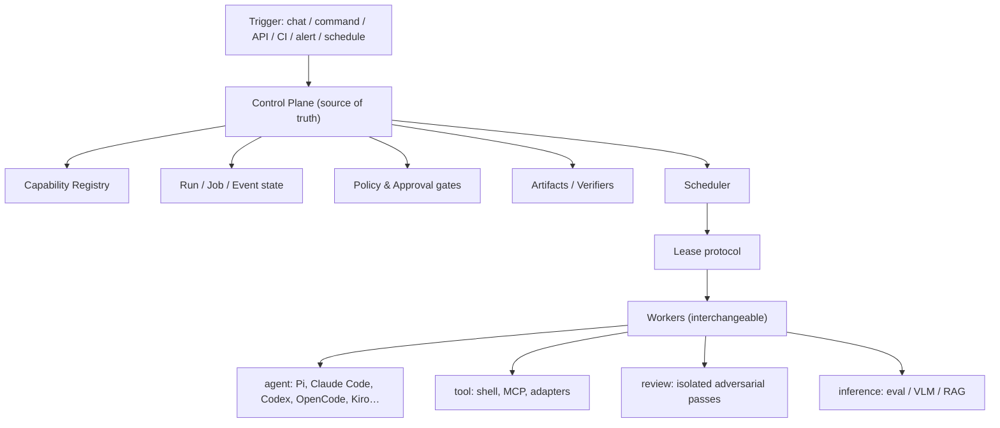

# Concepts

The mental model for how Oktopus turns agent work into durable, governed, auditable operations. This is the *what it is* layer; behavioral detail lives in the [Specifications](specs.md).

## Mental model

The controller owns state; workers are disposable and lease bounded work.

## Core entities

- **Project** — the tenant / repo / product / client boundary.
- **Run** — one invocation of a workflow or task.
- **Job** — a schedulable node in a workflow DAG, executed by a worker.
- **Attempt** — one execution try of a job; retries are inspectable, not overwritten.
- **Step** — an observable unit inside an attempt (model call, tool call, command).
- **Worker** — a process that registers, advertises capabilities, and leases jobs.
- **Lease** — a bounded, atomic assignment of a job to one worker.
- **Artifact / Event** — durable evidence and the append-only audit log.
- **Capability** — any versioned, governed unit in the registry (the primitives below).

→ Specs: `define-core-run-job-event-model`, `define-worker-lease-protocol`

## Capabilities & primitives

**Capability** is a governance term, not a functional one: any versioned, governed unit in the registry — all scoped and trust-gated the same way. The functional primitives underneath it:

| Primitive | What it is |
|---|---|
| **Runtime** | the engine that executes work — off-the-shelf (Claude Code, Codex, Cursor, shell) or custom |
| **Persona** | a single-role **harness**: role + allowed tools + skills + output contract + limits |
| **Tool / Adapter** | callable actions and integration bridges a persona may use |
| **Skill** | a reusable procedure a persona follows |
| **Workflow** | a DAG composing personas/jobs into multi-step work |
| **Verifier** | an evidence check that gates acceptance |
| **Policy** | code-enforced permissions, approvals, budgets |
| **Environment** | the execution boundary (local, worktree, container, VM) |

**Packaging** (bundles, not primitives): **skillpack**, **solution pack**.

A runtime runs a persona (a harness) in an environment, using tools/adapters and skills, under policy, producing outputs gated by verifiers. A workflow composes many personas.

*Runtime* here means the agent engine, not the sandbox the work runs in — that boundary is the *environment*.

You rarely build a runtime: take an off-the-shelf harness (Claude Code, Codex, …) and customize it through the standard primitives — the same persona, skills, tools, and policy apply on top of whatever runtime executes. The harness is shaped by portable patterns, not configured ad hoc per person.

→ Spec: `define-capability-registry-model`

## Evidence: artifact, stream, effect

Not all output is a stored file. A job is accepted when its work verifies in its **output modality**:

- **artifact** — a durable typed blob (report, diff, eval result); verified by its existence and content.
- **stream** — a conversational/stdout message delivered to a channel; verified by delivery, not a stored blob.
- **effect** — a state change on a real system (codebase edit, deploy, API call); verified by its consequence.

→ Spec: `define-artifacts-verifiers-policy`

## Workers and the lease protocol

Workers poll, match by capability/labels/policy, and **atomically** lease one job at a time. Leases have TTLs and heartbeats; a crashed worker's lease expires and the job is requeued or failed per its retry policy. The controller stays the source of truth so workers remain disposable.

→ Spec: `define-worker-lease-protocol`

## Workspaces, sessions, and images

Interactive and long-running work runs in a **workspace** — a persistent, warm environment bound to a session you can pause, resume, and revitalize. Workspaces are materialized from content-addressed **images** and captured as **snapshots**, stored in a dedicated image/snapshot backend distinct from run artifacts.

→ Specs: `define-enterprise-admin-marketplace-sessions`, `define-image-and-snapshot-store`

## Context

**Context** is the high-level name for the durable layer the control plane owns so work carries across runs and runtimes — switch the model, keep the context. Within it, **memory** is a distinct, longer-lived piece: scoped knowledge (user, team, org) that *accumulates* across runs and is reused by whichever runtime executes next. Context also covers a run or thread's live working set — artifacts, decisions, approvals, references — so a task can pause, resume, or move. Both are owned by the control plane, not the agent.

→ Spec: `define-enterprise-admin-marketplace-sessions`

## Two axes of work

Work is described by two orthogonal axes, not a fixed category:

- **Engagement lifecycle** — one-shot · interactive · long-running · scheduled · event-triggered
- **Output modality** — artifact · stream · effect

The axes are independent — any lifecycle pairs with any modality. An interactive session might stream a chat or edit code (effect); a one-shot job might write an artifact or apply a fix. One spine serves every combination.

## Example workflows

The spine isn't coding-specific. A workflow is any DAG of capabilities, in any domain:

- **Morning news digest.** Scheduled trigger → a news-source tool plus a summarizer agent → delivered as a stream to your chat channel, or saved as an artifact.
- **Inbound label processing.** A message channel drops product-label photos → a vision/OCR tool extracts fields → a database adapter writes the rows (effect) → an eval verifier checks them → the run completes on that evidence.

Both use the same primitives: input channels, registry capabilities, a job DAG, output modalities, and verifier-gated completion. A coding agent is one workflow among many — the platform runs whatever harness you compose.

## Local-first to distributed

The same concepts run on one machine or across a cluster — only the adapters change:

| Single-machine MVP | Distributed future |
|---|---|
| local registry files | signed org registry |
| `runs/<id>/events.jsonl` | event store / tracing DB |
| local worktree | remote sandbox / worker |
| direct tool call | queue / tool gateway |
| local artifacts | object store |
| local verifier command | CI / eval service |

Adapters change; capability concepts stay.
