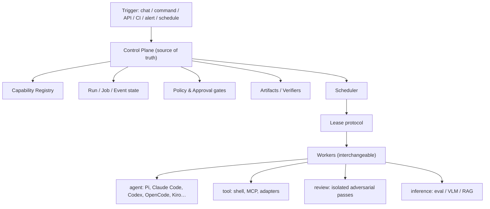

# Concepts

The mental model for how Oktopus turns agent work into durable, governed, auditable operations. This is the *what it is* layer; behavioral detail lives in the [Specifications](specifications.md).

## Mental model



The controller owns state; workers are disposable and lease bounded work.

## Core entities

- **Project** — the tenant / repo / product / client boundary.
- **Run** — one invocation of a workflow or task.
- **Job** — a schedulable node in a workflow DAG, executed by a worker.
- **Attempt** — one execution try of a job; retries are inspectable, not overwritten.
- **Step** — an observable unit inside an attempt (model call, tool call, command).
- **Worker** — a process that registers, advertises capabilities, and leases jobs.
- **Lease** — a bounded, atomic assignment of a job to one worker.
- **Artifact / Event** — durable evidence and the append-only audit log.
- **Capability** — a versioned tool, skill, persona, workflow, verifier, environment, policy, runtime, adapter, or solution pack.

→ Specs: `define-core-run-job-event-model`, `define-worker-lease-protocol`

## Evidence: artifact, stream, effect

Not all output is a stored file. A job is accepted when its work verifies in its **output modality**:

- **artifact** — a durable typed blob (report, diff, eval result); verified by its existence and content.
- **stream** — a conversational/stdout message delivered to a channel; verified by delivery, not a stored blob.
- **effect** — a state change on a real system (codebase edit, deploy, API call); verified by its consequence.

→ Spec: `define-artifacts-verifiers-policy`

## Workers and the lease protocol

Workers poll, match by capability/labels/policy, and **atomically** lease one job at a time. Leases have TTLs and heartbeats; a crashed worker's lease expires and the job is requeued or failed per its retry policy. The controller stays the source of truth so workers remain disposable.

→ Spec: `define-worker-lease-protocol`

## Workspaces, sessions, and images

Interactive and long-running work runs in a **workspace** — a persistent, warm environment bound to a session you can pause, resume, and revitalize. Workspaces are materialized from content-addressed **images** and captured as **snapshots**, stored in a dedicated image/snapshot backend distinct from run artifacts.

→ Specs: `define-enterprise-admin-marketplace-sessions`, `define-image-and-snapshot-store`

## Two axes of work

Work is described by two orthogonal axes, not a fixed category:

- **Engagement lifecycle** — one-shot · interactive · long-running · scheduled · event-triggered
- **Output modality** — artifact · stream · effect

A chat assistant is *interactive × stream*; a coding agent on a resumable workspace is *long-running × effect*. One spine serves all combinations.

## Capability graph

How the capability kinds compose:

```text
workflow uses personas
workflow uses skills
persona uses skills
skill uses tools
tool emits artifacts
verifier checks artifacts
memory records outcomes
```

## Local-first to distributed

The same concepts run on one machine or across a cluster — only the adapters change:

| Single-machine MVP | Distributed future |
|---|---|
| local registry files | signed org registry |
| `runs/<id>/events.jsonl` | event store / tracing DB |
| local worktree | remote sandbox / worker |
| direct tool call | queue / tool gateway |
| local artifacts | object store |
| local verifier command | CI / eval service |

Adapters change; capability concepts stay.
