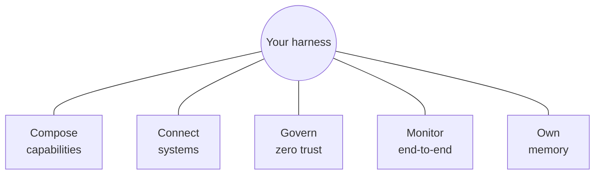

# The best harness is the one you own

Models come and go — harnesses endure.

## Pillars

```mermaid
flowchart TB
    Harness(("Your harness"))
    Harness --- Compose["Compose<br/>capabilities"]
    Harness --- Connect["Connect<br/>systems"]
    Harness --- Govern["Govern<br/>zero trust"]
    Harness --- Monitor["Monitor<br/>end-to-end"]
    Harness --- Own["Own<br/>memory"]
```

## Read next

[Oktopus](oktopus.md) — control plane for AI.
